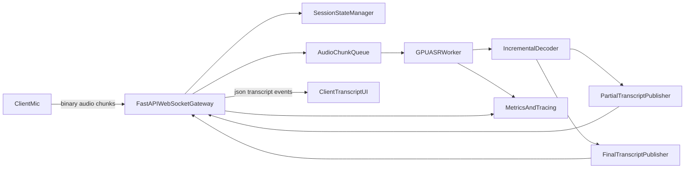

# Realtime ASR Backend Investigation (FastAPI + Hugging Face)

## 1) Objective

Build a production-ready backend for an end-to-end ASR pipeline where:
- Client streams live audio to backend.
- Backend performs near real-time transcription using Hugging Face compatible models.
- Backend continuously returns partial and final transcripts to the client UI.

Target constraints:
- **Primary language:** Sinhala
- **Rare code-mix:** occasional English words
- **Primary runtime:** GPU server
- **Backend framework:** FastAPI
- **Base ASR model:** `SPEAK-ASR/whisper-si-exp-5` (Hugging Face)

---

## 2) Success Criteria (Acceptance)

Functional:
- Supports real-time audio ingest over WebSocket.
- Emits both `partial` and `final` transcript events.
- Handles multiple concurrent user sessions safely.
- Supports reconnect and transcript continuity at utterance boundaries.

Quality:
- Stable Sinhala transcription with reasonable handling of occasional English words.
- No transcript duplication in final stream.
- End-of-utterance behavior is predictable.

Performance (initial targets for MVP on single GPU):
- Partial transcript update interval: 300-800 ms.
- Median finalization delay after user pause: < 1.5 s.
- Sustained concurrent sessions: start with 10-30, then tune.

Reliability:
- Graceful error signaling to clients.
- Session timeout and cleanup.
- Backpressure strategy when clients upload faster than processing.

---

## 3) Current Industry Patterns (2025-2026)

Most commonly used backend pattern for real-time transcription:
- **FastAPI WebSocket gateway** for bidirectional low-latency communication.
- **Per-session state manager** (audio buffer, decoder state, timestamps).
- **Inference worker layer** (GPU-bound model execution).
- **Incremental event protocol** for transcript updates (`partial`, `final`).
- **Observability hooks** (latency, queue depth, active sessions, error rates).

Two model execution patterns are used in production:
1. **Buffered chunk + overlap/stride**  
   - Common and practical baseline.
   - Works with non-native-streaming ASR models.
2. **Native streaming/cache-aware ASR**  
   - Better scaling at high concurrency.
   - Lower redundant computation because previous context is cached.

---

## 4) Model Strategy for Sinhala-First + Rare English Mix

## 4.1 Recommendation Summary

Use `SPEAK-ASR/whisper-si-exp-5` as the default production decode path for all sessions, then add fallback only when confidence is low on code-mixed segments.

Practical strategy:
- **Primary model path:** `SPEAK-ASR/whisper-si-exp-5` on GPU for Sinhala-first streaming transcription.
- **Fallback path:** optional secondary multilingual decode for uncertain windows with rare English code-mix.

This keeps MVP stable and aligned with your chosen Sinhala-focused base model.

## 4.2 Decision Matrix

1. **Selected base model: `SPEAK-ASR/whisper-si-exp-5` (Whisper family)**
- Pros:
  - Sinhala-focused base model aligned with your core use case.
  - Proven Whisper-style behavior for partial/final streaming with chunk buffering.
  - Large community examples with FastAPI + WebSocket.
- Cons:
  - Not always truly cache-aware streaming.
  - Can waste compute if overlap windows are too aggressive.

2. **Secondary option: generic CTC chunk+stride pipelines (HF transformers style)**
- Pros:
  - Efficient baseline for long audio with chunking.
  - Straightforward to implement.
- Cons:
  - Model/language quality depends heavily on checkpoint choice for Sinhala.
  - Partial stability may need extra post-processing logic.

3. **Alternative path: native streaming/cache-aware models**
- Pros:
  - Better scale behavior under concurrency.
  - Lower redundant compute and more stable latency.
- Cons:
  - Language coverage might be limited depending on checkpoint family.
  - Integration complexity can be higher.

## 4.3 Sinhala + English Code-Mix Policy

- Default decode language hint: Sinhala (`si`) using `SPEAK-ASR/whisper-si-exp-5`.
- Keep punctuation/casing normalization post-process optional in MVP.
- Add confidence-based fallback only for low-confidence segments:
  - If confidence drops below threshold on segment N, re-decode that short window using a multilingual fallback model.
- Avoid per-token language switching in MVP (adds complexity and instability).

---

## 5) Recommended Backend Architecture



Core components:
- **WebSocket Gateway:** authenticate client, receive audio frames, send transcript events.
- **SessionStateManager:** per-connection metadata, utterance IDs, partial buffer, cleanup timers.
- **AudioChunkQueue:** in-memory queue (or bounded async queue) for backpressure.
- **GPUASRWorker:** reads queued chunks, runs inference, updates decoder state.
- **IncrementalDecoder:** emits stable partials and finals without duplication.

---

## 6) API Contract (WebSocket)

Endpoint:
- `GET /ws/transcribe`

Client -> Server event types:
- `start`
- `audio_chunk`
- `end_utterance`
- `stop`
- `ping`

Server -> Client event types:
- `ack`
- `partial_transcript`
- `final_transcript`
- `warning`
- `error`
- `session_summary`

### 6.1 Client Message Examples

```json
{"type":"start","session_id":"s123","sample_rate":16000,"encoding":"pcm_s16le","channels":1,"language_hint":"si"}
```

```json
{"type":"audio_chunk","seq":42,"audio_b64":"<base64_pcm_bytes>","duration_ms":320}
```

```json
{"type":"end_utterance","seq":99}
```

```json
{"type":"stop"}
```

### 6.2 Server Message Examples

```json
{"type":"ack","session_id":"s123","message":"stream_started"}
```

```json
{"type":"partial_transcript","session_id":"s123","utterance_id":"u17","seq":42,"text":"මම දැන්","start_ms":1200,"end_ms":1680,"is_stable":false}
```

```json
{"type":"final_transcript","session_id":"s123","utterance_id":"u17","text":"මම දැන් පාඩම කියවනවා.","start_ms":1200,"end_ms":3120}
```

```json
{"type":"error","code":"INVALID_AUDIO_FORMAT","message":"Expected mono PCM16 at 16kHz"}
```

---

## 7) Streaming Logic Design

## 7.1 Audio Ingestion
- Normalize all incoming audio to mono PCM16 @ 16kHz at gateway boundary.
- Recommended chunk duration from client: 200-500 ms.
- Keep server queue bounded (e.g., max buffered audio 3-5 s per session).

## 7.2 Partial/Final Emission Policy
- Emit `partial` only when text changed meaningfully (character delta threshold).
- Mark final only when:
  - explicit `end_utterance`, or
  - VAD/silence threshold crossed, or
  - stream stop.
- Store last final boundary to prevent repeated text in subsequent utterances.

## 7.3 Backpressure
- If queue nearly full:
  - send `warning` event with `server_busy` or `high_latency`.
  - optionally drop oldest non-finalized audio windows (configurable).
- Never silently drop final transcript events.

---

## 8) Concurrency and Scaling Design

Single GPU Phase:
- Run one ASR worker process pinned to GPU.
- Use async WebSocket gateway with per-session queues.
- Tune max concurrent sessions conservatively first.

Scale-up Phase:
- Multiple ASR worker processes (or model replicas) behind internal task dispatcher.
- Route same session to same worker (sticky session key).
- Use distributed queue only when single-node capacity is reached.

Scale-out Phase:
- Horizontal pods with session affinity in ingress/load balancer.
- Shared telemetry backend.
- Model warm pools to reduce cold-start latency.

---

## 9) Reliability, Security, and Operational Guardrails

Security:
- WebSocket auth token required at connect.
- Tenant/session scoping in every event.
- Input validation: chunk size, sampling rate, encoding, sequence ordering.
- Rate limiting per session/IP.

Reliability:
- Heartbeat (`ping`/`pong`) and idle timeout.
- Graceful reconnect policy:
  - same `session_id` allowed within short recovery window.
- Deterministic cleanup:
  - release queue and model/session state after disconnect timeout.

Error handling:
- Standard error codes (`INVALID_AUDIO_FORMAT`, `QUEUE_OVERFLOW`, `MODEL_UNAVAILABLE`, `INTERNAL_ERROR`).
- Recoverable warnings vs terminal errors clearly separated.

---

## 10) Observability (Must Have)

Metrics:
- `asr_active_sessions`
- `asr_queue_depth`
- `asr_partial_latency_ms`
- `asr_finalization_latency_ms`
- `asr_chunk_drop_count`
- `asr_decode_error_count`

Logs:
- Structured logs with `session_id`, `utterance_id`, `seq`, latency fields.
- Separate logs for gateway and inference worker.

Tracing:
- One trace per utterance:
  - ingress receive -> queue wait -> inference -> decode -> outbound event.

Health endpoints:
- `/health/live`: process alive.
- `/health/ready`: model loaded, GPU accessible, queue below threshold.

---

## 11) Suggested Project Structure

```text
app/
  main.py
  api/
    ws_transcribe.py
  core/
    config.py
    logging.py
    metrics.py
  asr/
    model_loader.py
    streaming_engine.py
    decoder.py
    vad.py
  sessions/
    manager.py
    schemas.py
  workers/
    asr_worker.py
  tests/
    test_ws_protocol.py
    test_decoder_merge.py
    test_session_timeout.py
```

---

## 12) Phased Implementation Roadmap

## Phase 1 - MVP (Working Realtime Demo)
- Build WebSocket endpoint and protocol (`start`, `audio_chunk`, `stop`).
- Integrate `SPEAK-ASR/whisper-si-exp-5` as the primary GPU ASR model path.
- Emit partial and final transcripts.
- Add basic session state and timeout cleanup.
- Validate with Sinhala sample streams.

Exit criteria:
- End-to-end live transcription works with stable final events.
- No crashes over 30-minute soak test with at least 5 concurrent sessions.

## Phase 2 - Quality Stabilization
- Add end-of-utterance detection (silence or VAD-based).
- Improve partial stability logic (avoid flicker).
- Add confidence logging and optional fallback re-decode for weak segments.
- Add transcript post-processing hooks for punctuation/casing policy.

Exit criteria:
- Reduced partial jitter and better final consistency on noisy input.

## Phase 3 - Performance and Scale
- Add worker pool and sticky session routing.
- Add queue backpressure policy and warning events.
- Optimize chunk/window settings by benchmark.
- Add load test profile (10/25/50 concurrent sessions).

Exit criteria:
- Latency remains within target envelopes at agreed concurrency.

## Phase 4 - Production Hardening
- Full auth/rate-limit policy.
- End-to-end tracing and alerting.
- Deployment templates (Docker + GPU runtime).
- Runbook for failures and rollback.

Exit criteria:
- System is deployable, observable, and recoverable in production environments.

---

## 13) Benchmark and Validation Plan

Datasets to create internally:
- Clean Sinhala speech samples.
- Noisy Sinhala samples (office/background noise).
- Rare Sinhala-English code-mixed clips.

Measure:
- Word Error Rate proxy or task-specific transcript accuracy checks.
- Partial latency and finalization delay.
- Session failure rate under concurrency.
- Throughput vs GPU utilization.

Minimum benchmark matrix:
- Chunk size: 200 ms, 320 ms, 500 ms.
- Concurrency: 1, 5, 10, 25.
- Language modes: Sinhala-hint only vs fallback enabled.
- Base model profile: `SPEAK-ASR/whisper-si-exp-5` (default) vs fallback path enabled.

---

## 14) Risks and Mitigations

Risk: Rare English code-mixed words may be weaker than pure Sinhala segments.  
Mitigation: confidence-triggered short-window fallback decode for uncertain segments.

Risk: Partial transcript flicker hurts UX.  
Mitigation: stabilization threshold + timed emission policy.

Risk: Queue overflow under spikes.  
Mitigation: bounded queues + warning events + autoscale triggers.

Risk: Latency drift as sessions rise.  
Mitigation: worker isolation, batch tuning, and session affinity.

---

## 15) Immediate Next Build Tasks

1. Create FastAPI app skeleton with WebSocket route.
2. Define JSON schemas for inbound/outbound events.
3. Implement session manager with timeout + heartbeat.
4. Integrate `SPEAK-ASR/whisper-si-exp-5` GPU inference path.
5. Implement partial/final decoder and event publisher.
6. Add metrics, health checks, and structured logging.
7. Build simple load-test script with synthetic streamed chunks.

This sequence can directly become your engineering sprint backlog.
